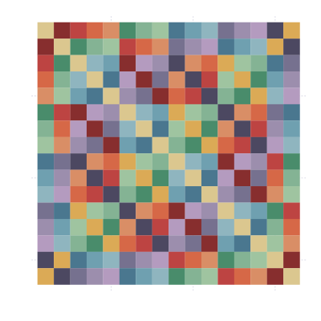

Working With The Dynamics Of A Relativistic Fluid
=================================================



The code in this repository is a work to calculate with and simulate the dynamics
of the relativistic fluid theorised by [Dr J.G.Williamson](http://www.gla.ac.uk/schools/engineering/staff/johnwilliamson/).


## algebra
Types, data structures and functions that are required to implement calculations
under the principle of Absolute Relativity.
I have tried as far as possible to enforce the principle within every type and
function definition and to provide an optimised implementation of computing
products and quotients within the algebra via pre-computing the Cayley Table
and providing helper functions to lookup values within it.

__NOTE__:: The variations on the algebra - whilst still being researched - can be
selected by altering the parameters at the top of the _algebra.jl_ file.


## numeric
_Not started yet_

Numerical methods and algorithms to compute results under AR.


## modeling
_Not started yet_

Attempts at modeling physical particles and situations.

__TODO__:: Look at modifying FDTD/FDFD algorithms and approaches to begin with.


## utils
Everything else! So far this contains some functions to visualise the nature of
the Cayley Table for the algebra as the parameters are modified.


--------------------------------------------------------------------------------

### Getting set up
While the repository contains all of the custom code that has been written for
the project, as we are not sharing this publicly at the moment the usual Julia
Pkg.add("AR") command can not be used to install it and bring in all of the external
libraries that I've used. The following commands should be run _the first time_
that you download the repository in order to get set up:

```bash
$ cd <path-to>/AR.jl
$ julia
...
julia> Pkg.add("Iterators")
julia> Pkg.add("Combinatorics")
julia> Pkg.add("Gadfly")
julia> Pkg.add("FactCheck")
```

Doing this will create your `~/.julia` directory which contains all code
installed using the Julia REPL tool. To simplify using the `AR` module you
should create a symlink to the `AR.jl` directory:

```bash
$ cd ~/.julia/v0.5          # This may be v0.4 if you have an old version
$ ln -s <path-to>/AR.jl AR  # The name for the link must be AR
```

Finally, if you are only going to use Julia for working with AR.jl then it is
recommended that you save the following as your `.juliarc.jl` file in your home
directory. This will autoload `AR` when you start the REPL and also give you a
couple of helpers to aid in further development of the code:

```
# My Defaults
println("Auto-loading the latest version of AR.jl...")
@time using AR

##############################################################################

"""
Run the test suite from the julia install directory.
This requires you to have symlinked the repo into your .julia directory
under the correct version subdirectory."""
function run_tests()
    currentdir = pwd()
    cd()
    cd(".julia/v0.5/AR")
    include("testrunner.jl")
    cd(currentdir)
end

"""
Reload the AR module."""
function refresh_AR()
    @time reload("AR")
    println("AR.jl refreshed successfully")
end
```

--------------------------------------------------------------------------------

### Links and Reading for Julia
* [Official Docs](http://docs.julialang.org/en/release-0.5/manual/)
* [WikiBook Tutorial](https://en.wikibooks.org/wiki/Introducing_Julia/)
* [Unit Testing in Julia](http://docs.julialang.org/en/release-0.5/stdlib/test/)
* [Gadfly Plotting Library](http://gadflyjl.org/stable/index.html)
* [Static Compilation](http://juliacomputing.com/blog/2016/02/09/static-julia.html)

### Selections from the docs
* [Style Guide](http://docs.julialang.org/en/release-0.5/manual/style-guide/)
* [Essentials](http://docs.julialang.org/en/release-0.5/stdlib/base/)
* [Collections](http://docs.julialang.org/en/release-0.5/stdlib/collections/)
* [Mathematics](http://docs.julialang.org/en/release-0.5/stdlib/math/)
* [Linear Algebra](http://docs.julialang.org/en/release-0.5/stdlib/linalg/)
* [Arrays](http://docs.julialang.org/en/release-0.5/stdlib/arrays/)
* [Strings](http://docs.julialang.org/en/release-0.5/stdlib/strings/)
* [Workflow Tips](http://docs.julialang.org/en/release-0.5/manual/workflow-tips/)
* [Performance Tips](http://docs.julialang.org/en/release-0.5/manual/performance-tips/)
* [Streams & Networking](http://docs.julialang.org/en/release-0.5/manual/networking-and-streams/)
* [Parallel Processing](http://docs.julialang.org/en/release-0.5/manual/parallel-computing/)
* [Interacting With The System Shell](http://docs.julialang.org/en/release-0.5/manual/running-external-programs/)
* [Packages](http://docs.julialang.org/en/release-0.5/manual/packages/)
